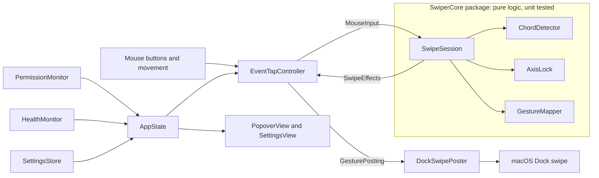

# Component diagram

```mermaid
flowchart LR
    Mouse[Mouse buttons and movement] --> Tap[EventTapController]
    Tap -->|MouseInput| Session[SwipeSession]
    Session --> Chord[ChordDetector]
    Session --> Lock[AxisLock]
    Session --> Map[GestureMapper]
    Session -->|SwipeEffects| Tap
    Tap -->|GesturePosting| Poster[DockSwipePoster]
    Poster --> macOS[macOS Dock swipe]
    Perm[PermissionMonitor] --> App[AppState]
    Health[HealthMonitor] --> App
    Store[SettingsStore] --> App
    App --> Tap
    App --> UI[PopoverView and SettingsView]
    subgraph SwiperCore [SwiperCore package: pure logic, unit tested]
        Session
        Chord
        Lock
        Map
    end
```
