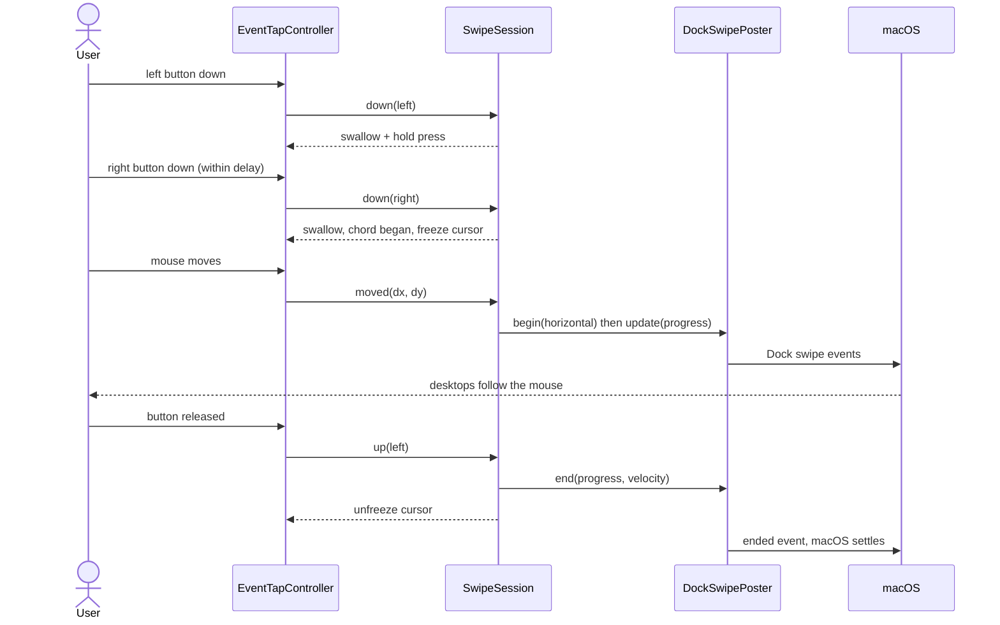

# Sequence: one horizontal swipe

```mermaid
sequenceDiagram
    actor User
    participant Tap as EventTapController
    participant S as SwipeSession
    participant P as DockSwipePoster
    participant OS as macOS
    User->>Tap: left button down
    Tap->>S: down(left)
    S-->>Tap: swallow + hold press
    User->>Tap: right button down (within delay)
    Tap->>S: down(right)
    S-->>Tap: swallow, chord began, freeze cursor
    User->>Tap: mouse moves
    Tap->>S: moved(dx, dy)
    S->>P: begin(horizontal) then update(progress)
    P->>OS: Dock swipe events
    OS-->>User: desktops follow the mouse
    User->>Tap: button released
    Tap->>S: up(left)
    S->>P: end(progress, velocity)
    S-->>Tap: unfreeze cursor
    P->>OS: ended event, macOS settles
```
